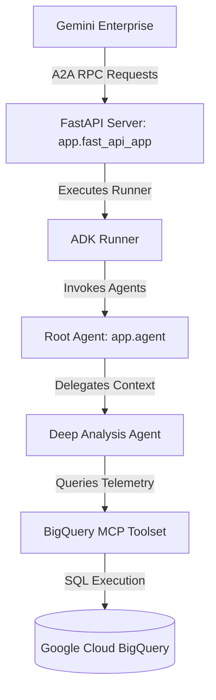

# Demo ADK Agent for Gemini Enterprise

This repository contains a containerized AI Agent built with the Google Agent Development Kit (ADK) that integrates with BigQuery using the Model Context Protocol (MCP). It is wrapped in a FastAPI server exposing standard Agent-to-Agent (A2A) endpoints for registration and messaging in Gemini Enterprise.

This demo is designed to be executed directly within **Google Cloud Shell** or any environment with `gcloud` authenticated access.

---

## Architecture



*   **`app/agent.py`**: Declares the AI agents:
    *   `root_agent`: Coordinates interactions, handles single-step/simple queries, and delegates complex telemetry tasks to `deep_analysis_agent`.
    *   `deep_analysis_agent`: Performs multi-step reasoning, telemetry synthesis, and multi-hop dependency graph analysis.
*   **`app/tools.py`**: Configures the BigQuery MCP Toolset, handles OAuth2 access token generation, and applies stability/JSON-RPC error patches for `httpx` connections.
*   **`app/fast_api_app.py`**: Main application file wrapping the agent runner inside standard A2A JSON-RPC endpoints.
*   **`app/part_converters.py`**: Converts A2A RequestContext payloads into native ADK runner arguments.

---

## Configuration

The agent dynamically retrieves configuration from the following environment variables (defined and passed dynamically during Cloud Run deployment):

| Variable | Description | Default / Source |
| :--- | :--- | :--- |
| `GOOGLE_CLOUD_PROJECT` | The project ID where the agent is running. | *Determined via GCP context* |
| `TARGET_PROJECT_ID` | GCP Project ID containing the target BigQuery dataset. | Configured via `TARGET_PROJECT_ID` in `deploy-gcp.sh` |
| `DATASET_ID` | BigQuery dataset name containing the telemetry tables. | Configured via `DATASET_ID` in `deploy-gcp.sh` |
| `AGENT_MODEL` | Gemini Model for the `deep_analysis_agent`. | `gemini-2.5-pro` |
| `AGENT_MODEL_LITE` | Gemini Model for the `root_agent`. | `gemini-2.5-flash` |
| `ADK_ENABLE_MCP_GRACEFUL_ERROR_HANDLING` | Enables resilient handling of MCP tool invocation failures. | `1` |

---

## Local Development

### 1. Requirements
*   Python `3.10` to `3.12`
*   Google Cloud SDK (`gcloud` CLI)

### 2. Installation
Set up a virtual environment and install the required dependencies:
```bash
python3 -m venv .venv
source .venv/bin/activate
pip install -r requirements.txt
```

### 3. Running Locally
Run the FastAPI development server:
```bash
uvicorn app.fast_api_app:app --host 0.0.0.0 --port 8080 --reload
```

---

## Cloud Shell Deployment

The deployment pipeline is fully automated using `deploy-gcp.sh` and tailored to run within Google Cloud Shell.

### 1. Variables Customization
At the beginning of `deploy-gcp.sh`, configure the following parameters:
*   `DATASET_ID`: Specify the name of your target BigQuery dataset (defaults to `melt_data_foundation_v04`).
*   `TARGET_PROJECT_ID`: Specify the GCP project ID hosting the BigQuery dataset. If left empty, it will default to your active gcloud project ID.

### 2. Execution
Run the deployment script:
```bash
chmod +x deploy-gcp.sh
./deploy-gcp.sh
```

**What the deployment script does:**
1. **API Check & Enablement**: Automatically checks and enables all required APIs (AI Platform, BigQuery, Discovery Engine, Cloud Run, Artifact Registry, etc.).
2. **Service Account Initialization**: Creates and initializes the Discovery Engine Service Identity.
3. **IAM Policy Bindings**: Grants required permissions to the default Compute Engine service account (`roles/mcp.toolUser`, `roles/bigquery.dataViewer`, etc.) and authorizes the Discovery Engine Service Agent to invoke the Cloud Run service.
4. **Container Build**: Builds the Docker container and pushes it to a local Artifact Registry repository using Cloud Build.
5. **Cloud Run Deployment**: Deploys the containerized service to Cloud Run.
6. **Gemini Enterprise Discovery & Registration**: Searches for any existing Gemini Enterprise Apps in your project. It deletes any old registrations and registers the agent with **Organization-level sharing enabled** (`scope = "ALL_USERS"`), allowing it to be immediately visible to all authorized users in the organization directory.

---

## Cleanup

To cleanly remove the deployed Cloud Run service, the Artifact Registry Docker image, and the registered agent from the Gemini Enterprise app, execute the cleanup script:

```bash
chmod +x cleanup-gcp.sh
./cleanup-gcp.sh
```
